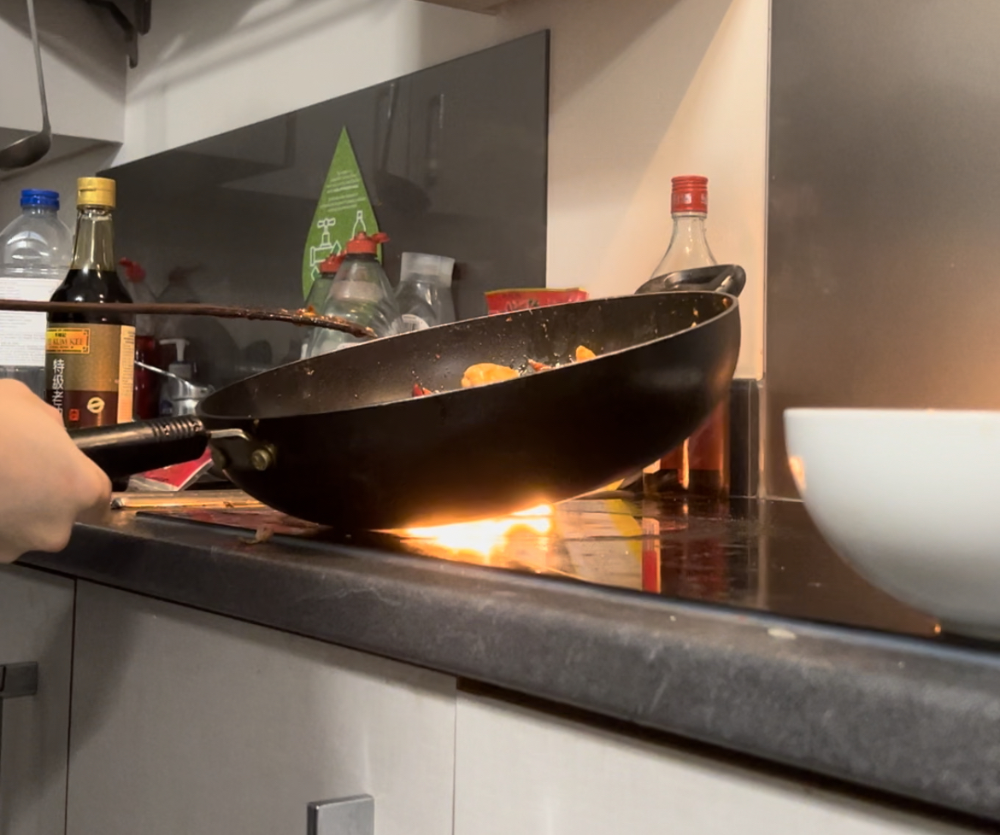

# Cookbook

Inspired by @Anduin2017 and a great experience spending dinners with Cyber Security Bad Guys, we are happy to create this project to share our receipes.

The dishes included in the project are already appeared in our dinner table.

## Notes

1. The cooking environment is based on Lancaster University Graduate College Superior Ensuite kitchen. You might need to adjust slightly some steps if you are in a different environment (mostly heat and cooking time).
2. Cooking needs great attention, do not leave your food cooking without any reminders.
3. Some dishes like soup may take more than 2 hours to cook, please be patient and set up reminders to avoid any kitchen accidents.
4. As the chefs are not very familiar with the allergies or the vegetarian/vegan sorting, you can always check the ingredients to see if the dish is suitable for you.
5. 菜谱中的中国菜都是经过改造的版本，为了保证在英国能买到相应的食材，运用英国当地贫瘠的食材做了替代(并标明了在哪里可以买到)

## Menu

#### Main
- [Seafood Noodles(Souped) 海鲜汤面](dishes/Seafood_Noodles_Souped.md)

#### Meat
- [Braised Pork Belly 红烧肉](dishes/Braised-Pork-Belly.md)
- [Curry with beef brisket 咖喱炖牛肉](dishes/Curry_with_beef_brisket.md)
- [Diced steak with black pepper sauce 黑椒牛柳](dishes/Diced-steak-with-black-pepper-sauce.md)
- [Kong Pao Chicken 宫保鸡丁](dishes/Meat/Gong-Bao-Ji-Ding.md)
- [Simplified Beef Wellington 简化版惠林顿牛排](dishes/Meat/Beef_Wellington.md)
- [Sizzling Fresh Squid with Beef and black pepper sauce 铁板鲜鱿牛柳](dishes/Sizzling-Fresh-Squid-and-Beef-with-black-pepper-sauce.md)
- [Whiskey Steak 威士忌牛排](dishes/Meat/Whiskey_Steak.md)

#### Vegetables
- [Boiled Lettuce 白灼生菜](dishes/Boiled_Lettuce.md)
- [Chinese Cabbage with Vinegar 醋溜白菜](dishes/Vegs/Cu_Liu_Bai_Cai.md)
- [Fried Purple Cabbage 炒紫甘蓝](dishes/Fried_Purple_Cabbage.md)
- [Spinach with Ginger 姜汁菠菜](dishes/Vegs/Jiang_Zhi_Bo_Cai.md)

#### Soup
- [Radish Beef Brisket Soup 萝卜牛腩汤](dishes/Radish_Beef_Brisket_Soup.md)

#### Sides
- [Roasted Chicken Wings 奥尔良鸡翅](dishes/Roasted-Chicken-Wings.md)

#### Dessert

- [Red Bean Paste](dishes/Desserts/Red_Bean_Paste.md)
- [Yorkshire Milk Pudding 约克夏奶布丁](dishes/Desserts/Yorkshire-Milk-Pudding.md)

#### Drinks
- [Bubble Milk Tea](dishes/Drinks/Bubble_Milk_Tea_wwdpm.md)
- [Caramel Milk Tea 焦糖奶茶](https://aiden-l.github.io/pages/notready/doge.html)

#### Coming Soon
- [Egg Tarts 蛋挞](https://aiden-l.github.io/pages/notready/doge.html)
- [Fried Pork in the Scoop 锅包肉](https://aiden-l.github.io/pages/notready/doge.html)
- [Mango Pomelo Sago 杨枝甘露](https://aiden-l.github.io/pages/notready/doge.html)
- [Original Flavoured Pork Intestines 九转大肠](https://aiden-l.github.io/pages/ban/ban.html)
- [Wax Gourd Pork Ribs Soup 冬瓜排骨汤](https://aiden-l.github.io/pages/notready/doge.html)

## Techniques

How to create fire on an electromagnetic oven, please find chances to visit our [kitchen](https://use.mazemap.com/#v=1&config=lancaster&zlevel=1&center=-2.786763,54.004061&zoom=18.5&campusid=341&sharepoitype=point&sharepoi=-2.78638%2C54.00420) to witness the talent show live, the chefs will teach you hand by hand!!!

	

The fire is created by oil, which will burn after it reaches its burning point.

However, there is a sequel debutted on Feburary 19, 2023 by the same chef, this time the fire was not at the bottom of the pot but inside the pot. 

	

Warning: The footages showed above are not CGI! Please do not try it unsafely. We do not take any responsibilities if you set your kitchen on fire.

## Daily Bloopers

	

	

How to spell author

## For developers
1. Please put your dishes into the folder "dishes" as a `.md` file.
2. Please note that there must be __no space__ in the file name.
3. There is a [template file](dishes/template_dish.md) that you can use to edit your dishes.
