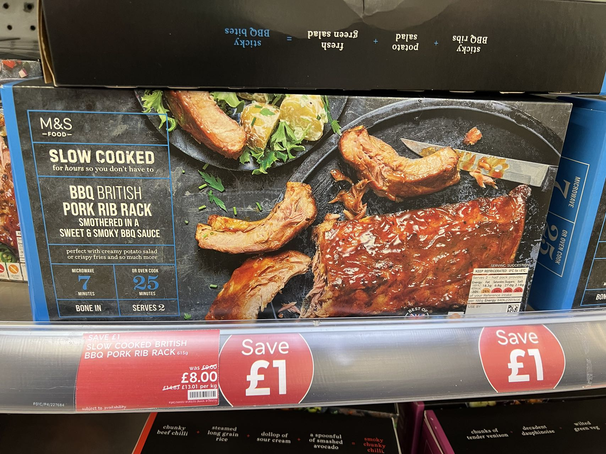

# BBQ Pork Rib Rack 烤猪排

## 前言

- 这个...首先你要有个烤箱，好吧，其次...没有其次，真的很简单
- 想吃烤排但不想自己配料的看进来，品鉴一下各大超市的烤排

## Ingredients 进货清单

- M&S Slow Cooked BBQ British Pork Rib Rack (如图)

    

## Steps 步骤

1. 记得看说明书，不会看？没关系，我帮你看
2. 烤箱200℃带风扇预热5分钟
3. 整个排拿出来，料先放一边，垫锡纸放烤箱200℃带风扇10分钟
4. 拿出来，正反刷上包装里的酱料，放回烤箱200℃带风扇15分钟

## Notes 注意事项

- 这么简单的菜都能搞糊？真有你的，小心点哇，别烤过头了
- 锡纸别用太薄的，底下可以刷点油防沾
