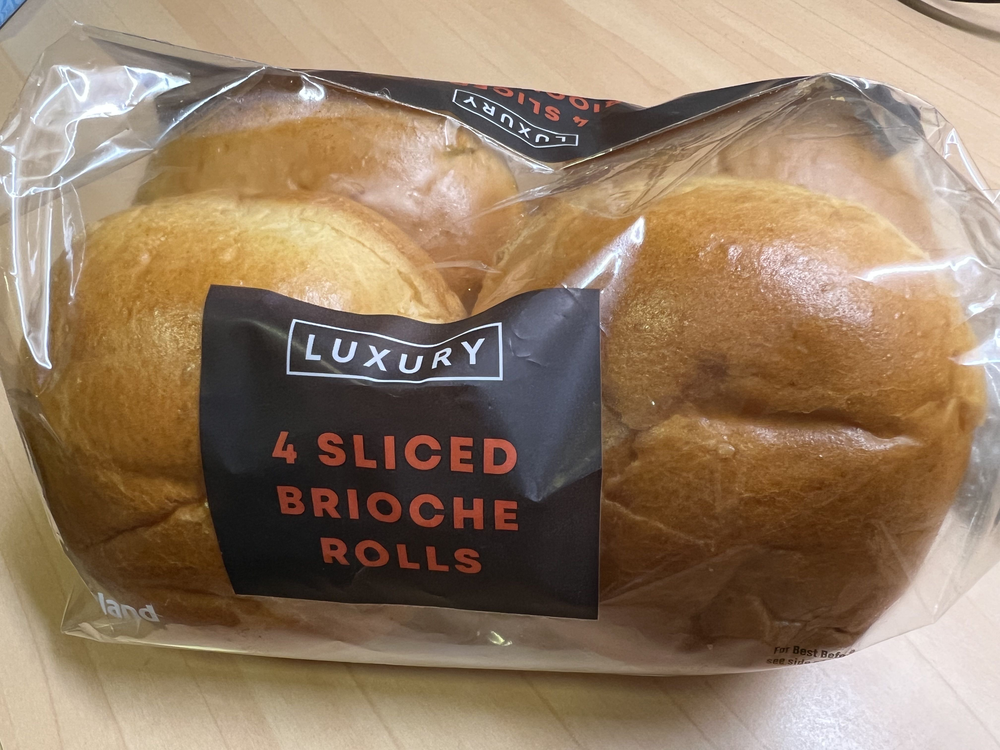
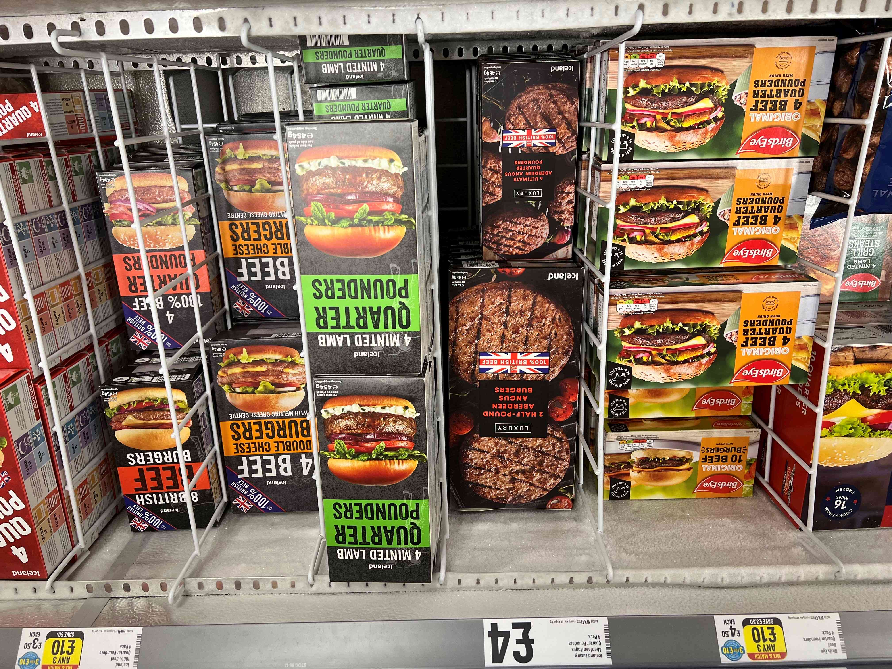

# Double Cheese Burger 汉堡

## 前言

- 汉堡自由不是梦，难道要自己动手和面，做肉饼？当然不是
- 我们的老朋友 Iceland，四个汉堡胚才1镑
- 肉饼也可以在同一地方买到，也是 Any 3 For 10! 还可以搭配上一篇的烤翅一起买，在家自己开快餐店
- 四个汉堡4.33镑，四舍五入一天三顿只需3镑！
- 关键还方便省时，早上做好带当午餐吃也可以，完美匹配英国没午休的辣鸡作息

## Ingredients 进货清单

- 4 Sliced Brioche Rolls from Iceland (￡1)

    

 

- 汉堡肉有很多选择，以下都可以选，推荐 4 Beef Double Cheese Burgers (Any 3 ￡10) 两片牛肉肉饼，中间夹着香浓芝士，非常不错

    

## Steps 步骤

1. 锅烧空气，倒入凉油，放入肉饼，煎至两面焦黄
2. 夹入面包，因为里面有芝士，这样直接吃味道也不错
3. 高配可以加培根，煎蛋，自己喜欢的各种酱料...

## Notes 注意事项

这么简单的菜都能搞糊？真有你的，小心点哇，别烤过头了
