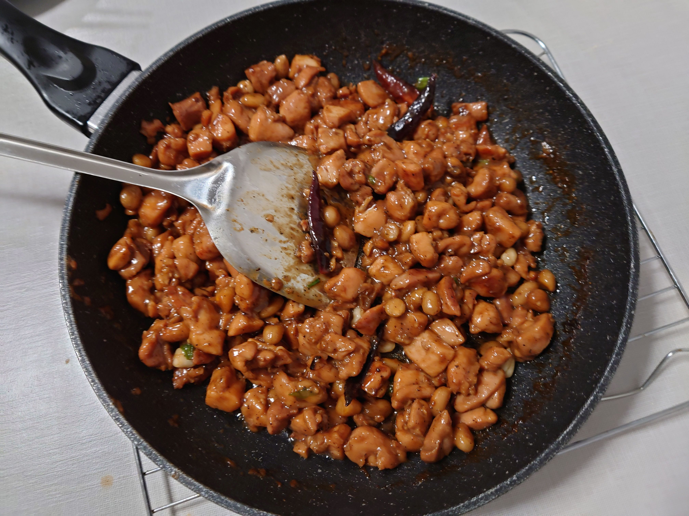

# Kong Pao Chicken 宫保鸡丁

## Ingredients 配料

- 去骨鸡腿肉640g (Sainsbury's British fresh chicken thigh fillets & boneless)

#### 腌料

- 淀粉1勺 (Sainsbury's cornflour)
- 料酒1勺 (Shaoxing rice wine from Sainsbury/Chinese supermarket)
- 黑胡椒20g (Tellicherry black pepper from Sainsbury)
- 酱油1勺 (Chinese supermarket)

#### 配料

- 小葱 (Sainsbury)
- 姜 (Sainsbury)
- 蒜 (Sainsbury)
- 大葱 (Sainsbury)
- 盐 (Sainsbury)
- 橄榄油 (Filippo Berio olive oil from Sainsbury)
- 花生 (Shandong peanuts from Chinese supermarket)

#### 料汁

- 生抽2勺 (Chinese supermarket)
- 料酒1勺 (Shaoxing rice wine from Sainsbury/Chinese supermarket)
- 白醋1勺 (Sainsbury's distilled vinegar)
- 蚝油1勺 (Chinese supermarket)
- 白砂糖1勺 (Sainsbury's white granulated sugar)
- 淀粉1勺 (Sainsbury's cornflour)
- 水3勺 (Tap water from Lake District)

## Preparation 备菜

1. 鸡腿肉切边长1.5cm立方体块，加入腌料抓拌均匀，冷藏腌制2小时以上
2. 小葱葱切段(0.5cm)，姜蒜切片
3. 大葱切段 (1.5cm)

## Steps 步骤

1. 花生加盐炒香
2. 热锅下冷油，转锅使油均匀摊开
3. 油热下葱姜蒜爆香
4. 下入鸡腿肉粒，炒至鸡肉由白刚刚变黄
5. 加入料汁翻炒均匀，加入大葱段，炒好的花生
6. 明火爆炒，大火收汁完成

    

 

## Notes 注意事项

不好吃就是自己做的不行，肯定不是菜谱的问题
