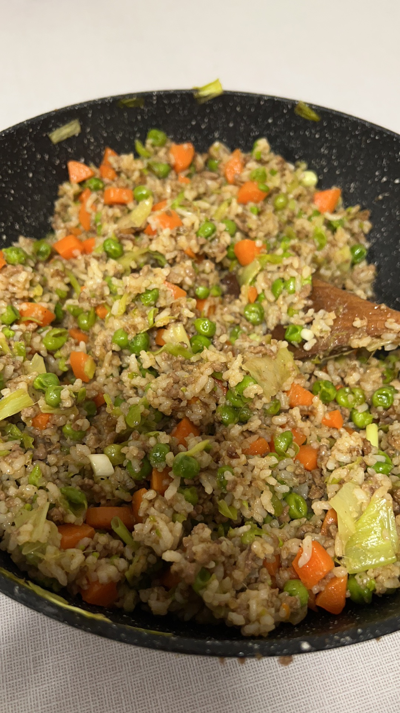

# Fried rice with peas leeks mince and carrots

<!-- 下面这行是标记用量是几个人吃的，不清楚删掉也行，更改的话2%20中的2改成其他数字即可 -->

<!-- 下面标题仅供参考，可随意修改，标题层次也不是固定的，随便改 -->
## Ingredients 配料

- 肉末250g (Sainsbury's British or Irish 5% Fat Beef Mince)
- 豌豆200g (Sainsbury's Garden Peas)
- 胡萝卜3根 (Sainsbury's Greengrocer Carrots)
- 韭葱1根 (Sainsbury's Leeks)
- 小葱1根 (Sainsbury's Spring onions Bunch)
- 剩饭一大锅 (Sainsbury's White Rice <Leftover Version>)

## Seasoning 调料
- 生抽 (Lee Kum Kee Premium Light Soy Sauce)
- 老抽 (Lee Kum Kee Premium Dark Soy Sauce)
- 盐 (Sainsbury's Table Salt Bottle)
- 姜汁啤酒/料酒 (Fentimans Ginger Beer)

## Steps 步骤

1. 豌豆焯水捞出备用\
Blanch the peas and set aside
2. 胡萝卜切丁，大葱切段，小葱切丁备用\
Carrots cut into dice, leeks cut into sections, spring onions cut into dice and set aside
3. 不用放油，肉末洗净倒入锅中翻炒，倒出炒制中的多余水分，加一勺姜汁啤酒，继续炒至没有多余水分，倒出备用\
Without oil, wash the minced meat, pour into the pan and stir-fry. Pour out the excess water, add a spoonful of ginger beer, continue to stir-fry until there is no excess water. Pour out the mince and set aside
4. 多放一点油，放入大葱炒香\
Put a little more oil in the pan, add the leeks and stir-fry
5. 放入胡萝卜丁和豌豆炒至断生\
Add diced carrots and peas and stir-fry until cooked
6. 倒入肉末搅拌均匀\
Pour in the minced meat and stir well
7. 倒入米饭翻炒均匀\
Pour in the rice and stir-fry well
8. 加入2勺生抽，1勺老抽，适量盐翻炒均匀\
Add 2 tablespoons of soy sauce, 1 tablespoon of soy sauce, salt and stir-fry well
9. 撒上葱花\
Sprinkle with chopped spring onions
10. 出锅！\
Serve!

<!-- 添加图片时需将图片上传至imgs/dishes文件夹下，路径仿照以下修改即可，注意图片名不能有空格和特殊符号 -->

    

 

## Notes 注意事项
    
田师傅强力推荐！
Chef Tian strongly recommends it!
