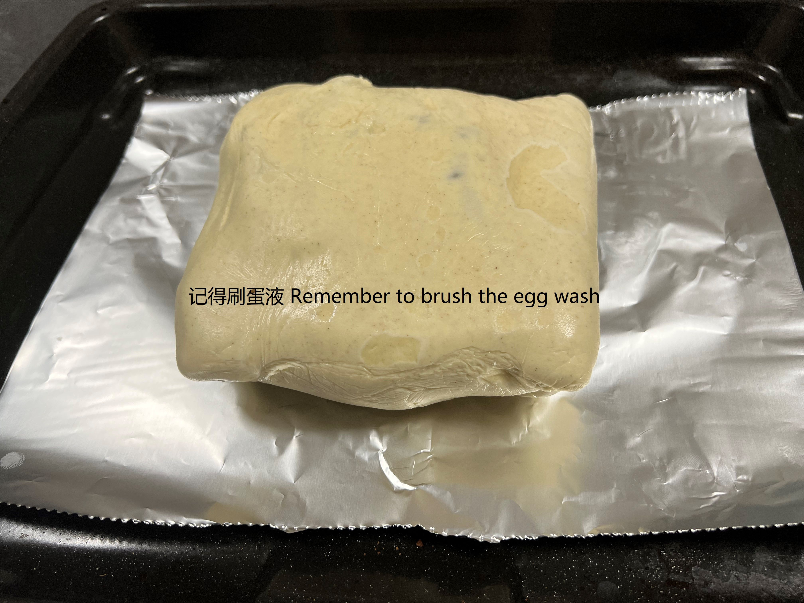

# Beef Wellington 惠灵顿牛排

## Ingredients 配料

- 蒜一头 (Sainsbury)
- 洋葱一头 (Sainsbury)
- 蘑菇一盒 (Sainsbury)
- 橄榄油 (Filippo Berio olive oil from Sainsbury)
- 黄油一薄片 (Sainsbury)
- 牛排一个 (Any you like)
- 黑胡椒 (Sainsbury)
- 盐 (Sainsbury)
- 鸡蛋一个 (Sainsbury's Large Egg)
- 酥皮 (Sainsbury's Ready Rolled Puff Pastry)

## Preparation 备菜

1. 蒜，洋葱切碎混合备用
2. 蘑菇切碎备用
3. 牛排自然解冻到室温，用厨房纸擦干表面，撒黑胡椒，盐腌制半小时

## Steps 步骤

1. 冷锅下冷橄榄油，加入蒜，洋葱末炒香
2. 加入蘑菇碎，加盐调味
3. 一开始蘑菇会出水分，大火炒至水分全干，略带一点焦香关火放凉备用
4. 牛排小火两面各煎1分钟，表面略带焦色即可，盛出醒肉1分钟
5. 将酥皮平铺开，将炒好的蘑菇酱平铺在上面，如下图所示

    

        
    

6. 从一边卷起，包好，用保鲜膜包好放冷冻室1小时

    

        
    

	
	

	    
	

7. 表面刷蛋液烤箱200度带风扇烤20分钟
    
	

	    
	

## 成品展示

	

	
另一道菜是吴大厨的，在线催更！！！

## Notes 注意事项

这道菜不要在伤心的时候做，切碎那些食材真的很烦，而且洋葱还贼辣眼睛
