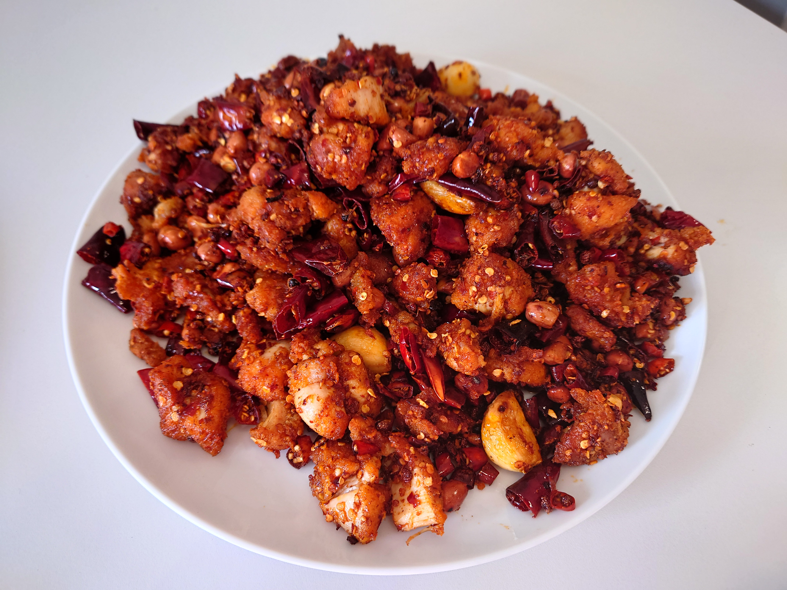
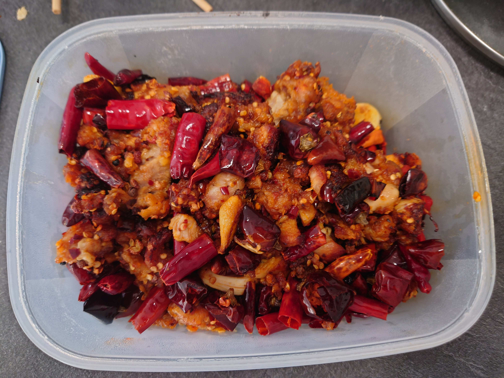
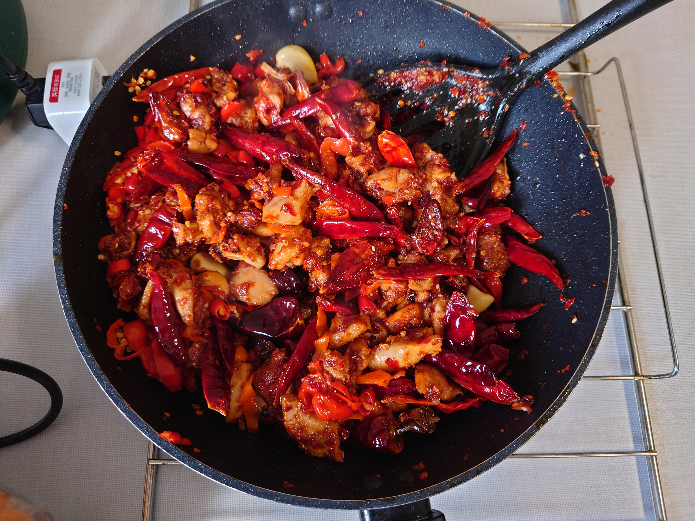

# Spicy Chicken 2.0 辣子鸡 2.0

## Intro 简介

This dish is inspired by the previous made of spicy chicken 1.0, which received a lot feedbacks. After 3 weeks of research and modification, I honorly present the brand new spicy chicken 2.0

从二月起，数个月的辣子鸡1.0得到了不少的反馈，在经过3周的研究和重构之后，在此荣誉推出全新的辣子鸡2.0

This recipe is slightly different from the previous versions. However the main principle remains same.

本菜谱于辣子鸡1.0的做法基本相同，但是有多处改动。

## Ingredients 配料

Boneless Chicken Thigh 无骨鸡腿肉

Thick broad-bean Sauce 豆瓣酱

Cooking Wine 料酒

Corn Starch 玉米淀粉

Five Spice Powder 五香粉

Chili Powder 辣椒面

White Pepper 白胡椒

Bird Eye Chili 小米椒

Garlic 大蒜

Peanuts 花生

Sichuan Pepper 花椒

Salt 盐

Flour 面粉

Chicken Bouillon Powder 鸡精

Tabasco Extra Scorpion Sauce 特质辣椒酱

Oil 油

## Steps 步骤

1. Dice the chicken thigh

    将鸡腿肉切成小块

2. Marinate the meat with cooking wine, corn starch, white pepper, five spice powder, flour. Mix them all and place it for 40 minutes.

    用料酒、淀粉、白胡椒、五香粉和面粉将鸡肉腌制，充分拌匀静置40分钟。

3. Use salt to cook the raw peanuts.

    用盐干炒生花生

4. Slice the bird eye chili, peel off the garlic

    将辣椒切成碎状，剥蒜

5. Place and heat oil in the pan, when it's heated place chicken inside, refill the oil to make it cover the chicken

    在锅内热油，当热到一定温度时放入鸡肉，将油补充到刚好沫过鸡肉

6. Fry the chicken until its color turns yellow or dark brown

    将鸡肉炸至金黄色或棕黄色

7. Put oil in the pan, add Sichuan pepper, chili sauce and chili(in the order)

    起锅热油，加入辣椒酱、花椒和辣椒爆香（先加入花椒，再放辣椒酱和辣椒）

8. Add chicken and garlic into the pot, then stir. While stiring, add chicken bouillon powder

    放入炸好的鸡肉和大蒜后翻炒，翻炒后在锅上撒一圈鸡精

9. The dish is ready to serve.

    翻炒3分钟后即可出菜。

## Notes 备注

1. This dish is extremely spicy, ready milk and tissues.

    本菜品会比一般的辣子鸡辣很多，食用前请准备好纸巾，牛奶或其它解辣用品。不建议孕妇、需要忌口的人士食用。

2. Thick broad-bean Sauce is optional while marinating.

    腌制时，可以选用豆瓣酱（我用的是郫县豆瓣酱，这个豆瓣酱偏咸，也是这道菜不需要用盐的原因）

3. The frying oil can be reused, but I don't recommend to use it more than 3 times.

    炸油可以复用，甚至可以用于其他的菜上，但是不建议使用3次。

## Showcase 展示

	

	

	

## Easter Egg 彩蛋

Welcome our biggest victim

有请头号小白鼠/受害者：

由于Github不能直接播放视频，请移步文件夹内cooking_recipe/main/imgs/dishes/lafanle.mp4观看
