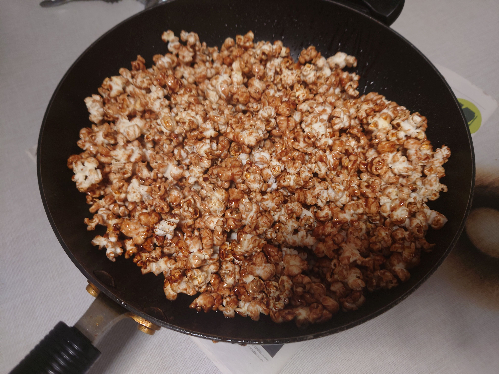

## Popcorn 爆米花

## Ingredients 配料

Butter 黄油

Popcorn 玉米粒

### Sweet 甜味

Sugar 白砂糖

Honey 蜂蜜

### Salty 咸味

Salt 盐

## Steps 步骤

1. Heat the butter in the pan

    在锅中热油

2. Put the popcorns(3*amount of butter) in the pan and mix it with the ingredients

    将玉米粒（与黄油的比例呈3：1）加入锅内，并加入配料拌匀

3. When the first popcorn start popping, cover the pan. Shake it to prevent the popcorn from burnt.

    当第一个玉米开始爆的时候，盖上锅盖，继续摇动锅，以防止锅里的爆米花烧糊。

4. When the pan stopped popping, take off the cover and wait till it cool down for 2 minutes. It is ready to eat.

    当锅停止爆的时候，打开锅盖静置/扇风2分钟后，即可食用。

## Notes 注意事项

1. You can add ingredients (e.g.: chocolate) to turn the popcorn to other flavors you want. (The picture shown below is a sweet chocolate popcorn)

    你可以加入不同的配料来调整爆米花的口味（图示为巧克力甜爆米花）

	

    

Sweet Chocolate Popcorn by wwdpm_b1owcar, Aiden and Brother Hao, February 24, 2023

2. It is recommended to have one frying pan (with cover) to make this snack.

    推荐使用带锅盖的炒锅来制作爆米花